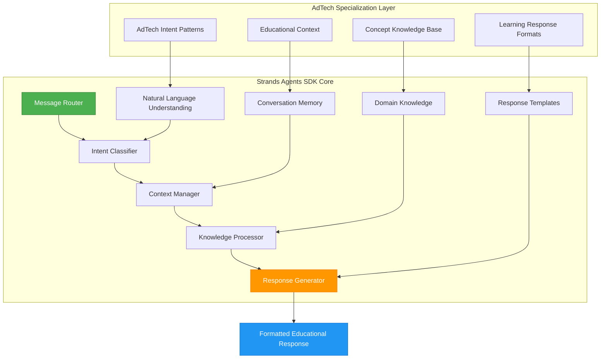
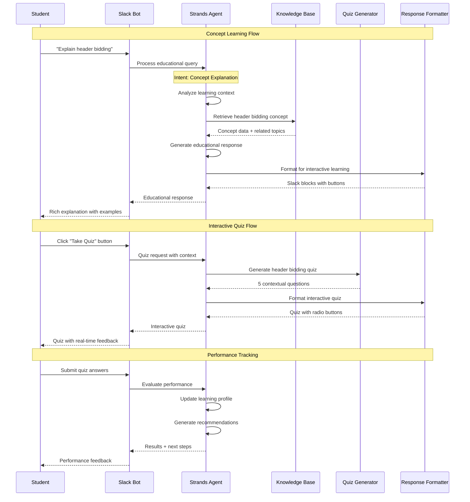
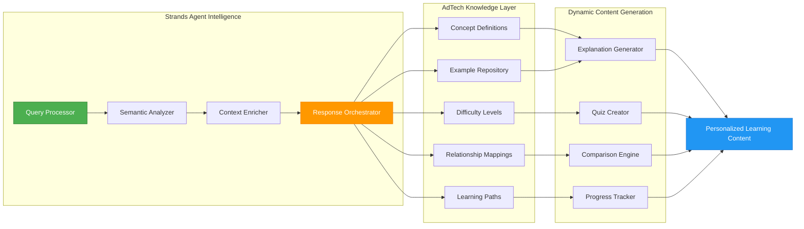
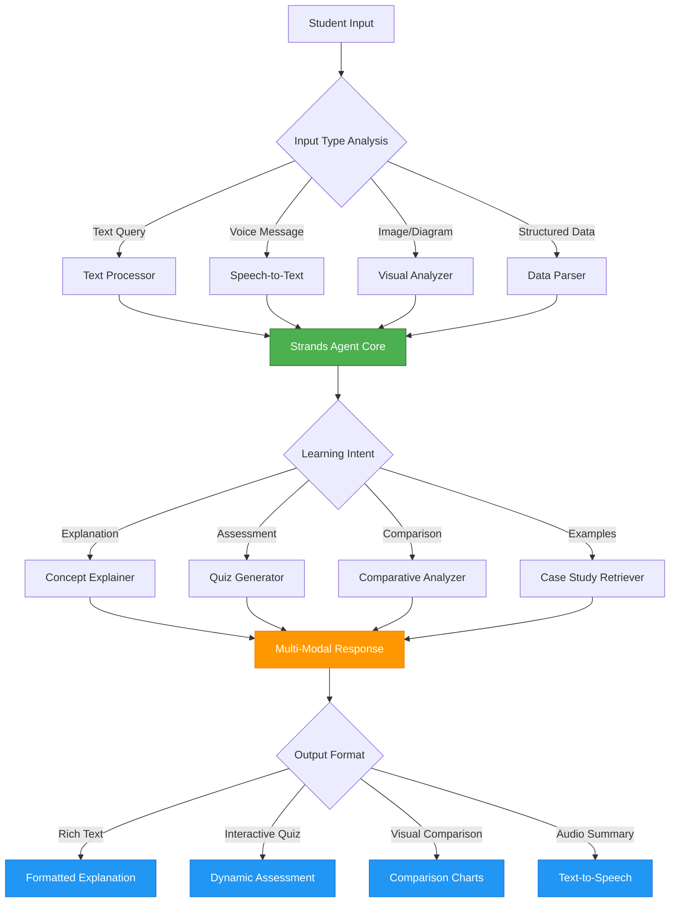
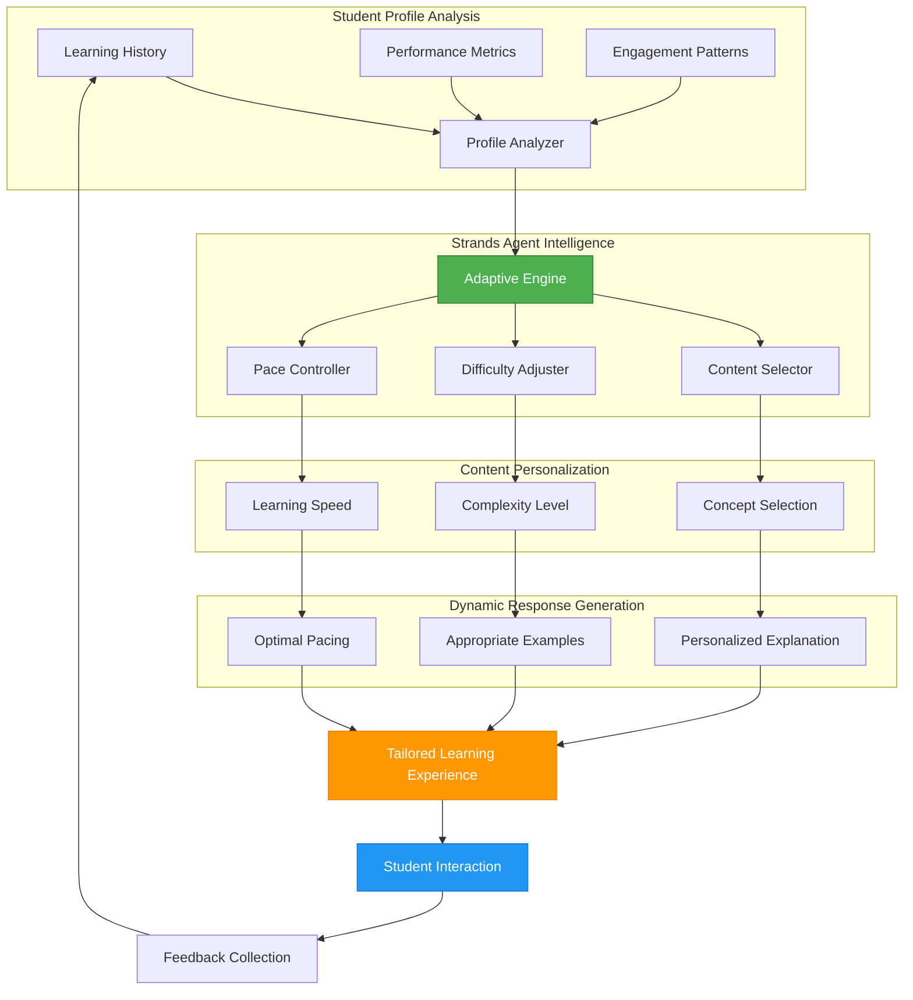
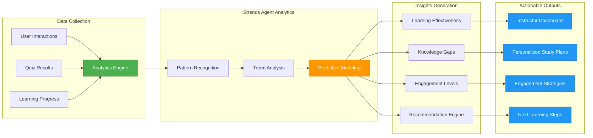
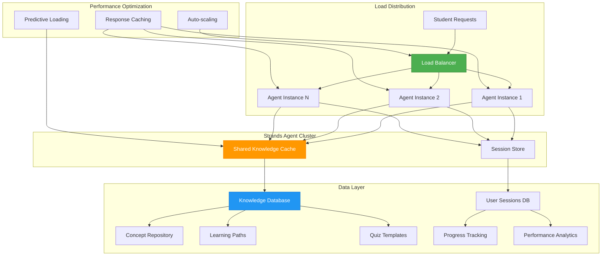
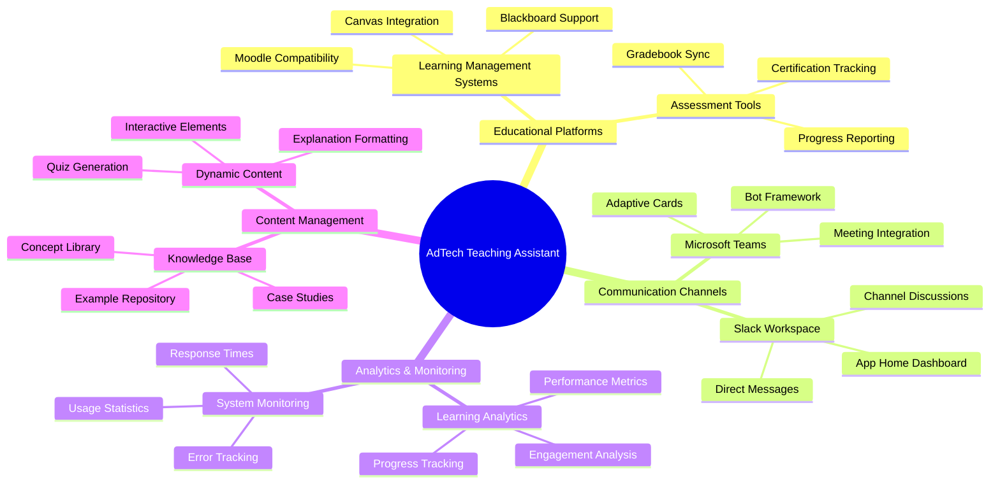
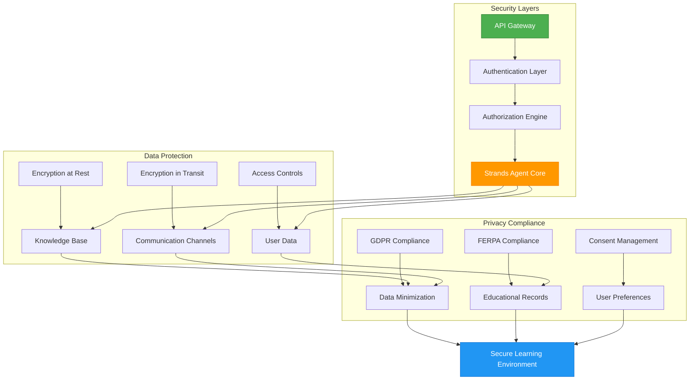
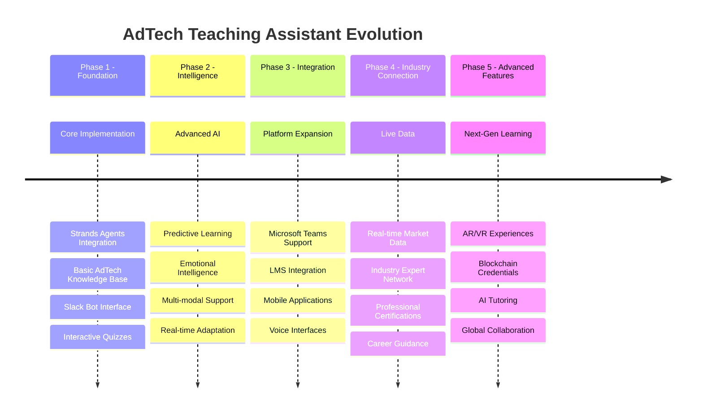

# AdTech Teaching Assistant - Architecture Diagrams

This document contains detailed architecture diagrams for the blog post and technical documentation.

## 1. Strands Agents Core Architecture

## 2. Learning Interaction Flow

## 3. Knowledge Base Integration Architecture

## 4. Multi-Modal Learning Support

## 5. Adaptive Learning Algorithm

## 6. Real-Time Performance Analytics

## 7. Scalability and Performance Architecture

## 8. Integration Ecosystem

## 9. Security and Privacy Architecture

## 10. Future Enhancement Roadmap

These diagrams provide comprehensive visual representations of the AdTech Teaching Assistant's architecture, showcasing how Strands Agents SDK powers intelligent educational experiences.
