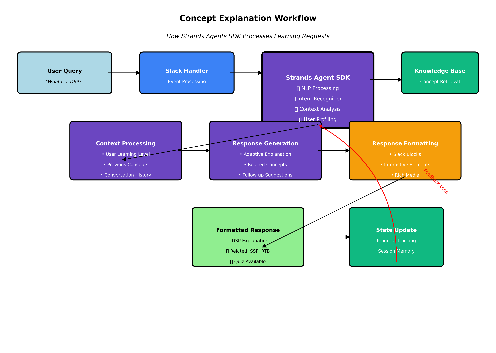

# Building an Intelligent AdTech Teaching Assistant: How Strands Agents SDK Powers Next-Generation Educational Experiences

In the rapidly evolving world of programmatic advertising, education has struggled to keep pace with industry complexity. Traditional learning methods fall short when trying to explain the intricate relationships between DSPs, SSPs, RTB protocols, and privacy frameworks. That's where our AdTech Teaching Assistant comes in—a revolutionary Slack bot that transforms how students and professionals learn about programmatic advertising, powered by the sophisticated Strands Agents SDK.

## The Challenge: Making Complex AdTech Accessible

Programmatic advertising isn't just complicated—it's a web of interconnected technologies, protocols, and business relationships that can overwhelm even experienced professionals. Students entering this field face a steep learning curve, trying to understand how demand-side platforms communicate with supply-side platforms through real-time bidding, while navigating privacy regulations and attribution models.

Traditional educational approaches—textbooks, static presentations, and generic online courses—simply can't capture the dynamic, conversational nature of how AdTech knowledge is actually shared in the industry. We needed something more intelligent, more adaptive, and more engaging.

## Enter Strands Agents SDK: The Intelligence Behind the Conversation

At the heart of our AdTech Teaching Assistant lies the Strands Agents SDK, a powerful framework that transforms static knowledge into intelligent, conversational experiences. But this isn't just another chatbot framework—it's a sophisticated agent platform that understands context, maintains learning state, and adapts to individual user needs.

### The Agent as the Central Nervous System

The Strands Agent serves as the central nervous system of our entire application. When a student asks, "What's the difference between a DSP and an SSP?", the magic happens within the agent's processing pipeline:

```python
agent = AdTechTeachingAgent(api_key, agent_id)
response = await agent.process_message(message, user_id)
```

The agent doesn't just pattern-match keywords—it understands the learning context. It knows whether this student is a beginner encountering these concepts for the first time or an intermediate learner ready for nuanced comparisons. This contextual awareness is what separates our teaching assistant from simple FAQ bots.

## Technical Deep Dive: How Concept Explanation Works

To understand the sophistication of our system, let's examine the technical workflow that occurs when a student asks about an AdTech concept. The following diagram illustrates the complete process flow:



### Step-by-Step Breakdown

1. **User Query Processing**: When a student types "What is a DSP?", the Slack handler captures this event and forwards it to our processing pipeline.

2. **Strands Agent Core Processing**: This is where the magic happens. The Strands SDK performs:
   - **NLP Processing**: Understanding the intent behind the question
   - **Intent Recognition**: Identifying this as a concept explanation request
   - **Context Analysis**: Analyzing the user's learning history and current session
   - **User Profiling**: Determining the appropriate explanation depth and style

3. **Knowledge Base Integration**: The agent queries our comprehensive AdTech knowledge base, but it's not just retrieving static information. The Strands SDK enables the agent to understand relationships between concepts, difficulty progressions, and learning dependencies.

4. **Contextual Response Generation**: The agent generates a personalized explanation that:
   - Adapts to the user's learning level
   - References previously learned concepts
   - Suggests related topics for further exploration
   - Includes interactive elements like quizzes

5. **Continuous Learning Loop**: Every interaction feeds back into the system, improving future responses and updating the user's learning profile.

### Natural Language Processing That Actually Understands AdTech

The Strands SDK brings sophisticated NLP capabilities specifically tuned for our domain. When a student types "How does header bidding work?", the agent recognizes this as a request for technical explanation about a specific programmatic technique. It understands the intent, identifies the appropriate difficulty level based on the user's history, and crafts a response that builds on previously learned concepts.

## Multi-Turn Conversation Intelligence

One of the most impressive capabilities of our system is its ability to maintain context across multiple conversation turns. Traditional chatbots lose context between messages, but the Strands Agent maintains rich conversational state:


### Context-Aware Learning Conversations

The diagram above shows how our system handles a typical learning conversation:

1. **Turn 1**: Student asks "What is RTB?" - Agent provides beginner-level explanation
2. **Turn 2**: Student follows up with "How fast is it?" - Agent understands the context and explains auction timing
3. **Turn 3**: Student asks "What if bid fails?" - Agent recognizes advanced interest and explains timeout handling

Throughout this conversation, the Strands Agent:
- **Maintains Context Memory**: Remembers what was discussed and builds upon it
- **Tracks Learning Progress**: Notes the progression from basic to advanced questions
- **Adapts Difficulty**: Automatically adjusts explanation complexity based on demonstrated understanding
- **Suggests Next Steps**: Recommends related concepts like DSP integration or bid optimization

## Intelligent Quiz Generation and Assessment

Perhaps most impressively, the agent doesn't just answer questions—it asks them. Our quiz generation system creates contextually appropriate assessments that adapt in real-time:


### Adaptive Assessment Creation

The quiz generation workflow demonstrates the sophistication of our educational approach:

1. **User Profile Analysis**: The system analyzes learning progress, identifies weak areas, and understands individual learning patterns.

2. **Knowledge Gap Detection**: Using advanced analytics, the agent identifies specific concepts that need reinforcement and maps them to appropriate difficulty levels.

3. **Dynamic Question Generation**: Rather than using pre-written questions, the system generates targeted questions that address specific learning gaps.

4. **Real-time Adaptation**: As students answer questions, the system adjusts difficulty and generates follow-up questions based on performance.

5. **Performance Analytics**: The system provides detailed feedback and updates learning recommendations based on quiz results.

This creates a truly personalized assessment experience where no two students receive identical quizzes, and each assessment is optimized for individual learning needs.

## Personalized Learning Path Generation

The Strands Agent doesn't just respond to questions—it proactively guides learning through personalized curriculum paths:


### Adaptive Curriculum Design

Our learning path system demonstrates how AI can create truly personalized educational experiences:

- **Dynamic Level Progression**: Students move from Beginner → Intermediate → Advanced → Expert based on demonstrated mastery, not fixed timelines
- **Concept Dependencies**: The system understands prerequisite relationships and ensures foundational concepts are mastered before advancing
- **Individual Adaptation**: Learning paths adapt to individual interests, career goals, and learning styles
- **Real-time Optimization**: Paths continuously evolve based on performance data and engagement patterns

For example, Sarah, a marketing student, receives a learning path focused on the business applications of AdTech concepts, while Mark, a technical professional, gets deeper technical implementation details.

## The Architecture: How Everything Connects

Our application follows a sophisticated architecture where the Strands Agent orchestrates multiple specialized components:

### The Knowledge Base Integration

The agent seamlessly integrates with our comprehensive AdTech knowledge base, but it's not just retrieving static information. The Strands SDK enables the agent to understand relationships between concepts, difficulty progressions, and learning dependencies:

```python
kb = AdTechKnowledgeBase()
concept = kb.get_concept("dsp")
related = kb.get_related_concepts("dsp")
```

When explaining DSPs, the agent knows to reference ad exchanges and RTB protocols. When a student shows mastery of fundamentals, it automatically suggests more advanced topics like private marketplaces or programmatic direct deals.

### Slack Integration That Feels Native

The Strands Agent seamlessly integrates with Slack through our bot interface, but the intelligence remains centralized in the agent layer:

```python
bot = AdTechSlackBot(bot_token, app_token, signing_secret, 
                     strands_api_key, strands_agent_id)
```

This architecture means the conversational intelligence isn't tied to Slack—the same agent could power web interfaces, mobile apps, or even voice assistants. The Strands SDK provides the abstraction layer that keeps the intelligence portable and platform-agnostic.

## Real-World Learning Scenarios

### Scenario 1: The Curious Beginner

Sarah, a marketing student, joins the Slack workspace and asks, "I keep hearing about programmatic advertising. Where do I start?"

The Strands Agent recognizes this as a beginner-level inquiry and initiates a structured learning path. It doesn't overwhelm Sarah with technical details about OpenRTB protocols. Instead, it starts with fundamental concepts, using analogies and real-world examples that build understanding progressively.

The agent tracks Sarah's engagement, noting which explanations resonate and which concepts require additional reinforcement. This learning state persists across sessions, allowing Sarah to pick up where she left off days later.

### Scenario 2: The Experienced Professional

Mark, an experienced media buyer, asks about the latest developments in privacy-compliant audience targeting. The Strands Agent recognizes Mark's expertise level from previous conversations and provides advanced technical details about topics like contextual targeting algorithms and privacy sandbox implementations.

The agent doesn't waste Mark's time with basic definitions—it jumps straight to the nuanced technical and strategic considerations that matter to his role.

### Scenario 3: The Interactive Learner

Jessica prefers learning through quizzes and challenges. The agent recognizes this preference and automatically generates interactive assessments tailored to her progress. When she struggles with attribution modeling concepts, the agent provides additional examples and creates follow-up questions that reinforce the learning.

## The Technical Magic: What Makes Strands Special

### Context Preservation Across Sessions

Traditional chatbots lose context between conversations. The Strands Agent maintains rich user profiles that include learning progress, preferred explanation styles, areas of strength and weakness, and conversation history. This enables truly personalized educational experiences.

### Intent Recognition Beyond Keywords

The SDK's NLP capabilities understand not just what students are asking, but why they're asking it. A question about "viewability" might be seeking a basic definition, asking about measurement techniques, or exploring optimization strategies. The agent uses conversational context and user history to determine the appropriate response depth and focus.

### Adaptive Response Generation

The Strands Agent doesn't just retrieve pre-written responses—it generates contextually appropriate explanations that build on previous learning. If a student has already mastered DSP concepts, explanations of SSPs will reference that knowledge rather than starting from scratch.

## Performance Metrics and Learning Analytics

Our system continuously monitors and optimizes the learning experience through comprehensive analytics:

### Key Performance Indicators

- **Learning Velocity**: How quickly students progress through concepts
- **Retention Rates**: Long-term knowledge retention measured through spaced repetition
- **Engagement Depth**: Quality of questions and follow-up interactions
- **Concept Mastery**: Demonstrated understanding through varied question types
- **Path Optimization**: Effectiveness of personalized learning sequences

### Real-time Adaptation

The Strands Agent uses these metrics to continuously improve:
- **Content Difficulty**: Automatically adjusting explanation complexity
- **Learning Pace**: Speeding up or slowing down based on comprehension
- **Interest Alignment**: Focusing on topics that generate the most engagement
- **Knowledge Gaps**: Identifying and addressing specific learning deficiencies

## The Learning Experience: Beyond Traditional Education

### Conversational Learning Paths

Instead of rigid course structures, our teaching assistant creates dynamic learning paths that adapt to individual progress and interests. The Strands Agent identifies knowledge gaps and suggests relevant concepts, creating a personalized curriculum that evolves with each interaction.

### Immediate Feedback and Reinforcement

When students complete quizzes or ask follow-up questions, the agent provides immediate, contextual feedback. This isn't generic "correct" or "incorrect" responses—the agent explains why answers are right or wrong, connecting them to broader AdTech concepts and real-world applications.

### Social Learning Integration

The Slack integration enables peer learning opportunities. The agent can facilitate group discussions, pose questions to multiple students, and even create collaborative learning challenges that encourage knowledge sharing.

## Implementation Insights: Technical Considerations

### Scalability and Performance

The Strands SDK handles the complexity of maintaining thousands of concurrent learning sessions, each with unique context and state. The agent architecture scales horizontally, allowing us to support growing user bases without degrading the personalized experience.

### Data Privacy and Security

Educational data requires special handling. The Strands platform provides enterprise-grade security while maintaining the rich context necessary for personalized learning. User progress and conversation history are encrypted and access-controlled.

### Integration Flexibility

The SDK's modular architecture allows us to integrate with various educational platforms, learning management systems, and communication tools beyond Slack. This flexibility ensures our teaching assistant can adapt to different institutional needs.

## The Future: Expanding Beyond AdTech

While our current focus is programmatic advertising education, the Strands Agents SDK provides a foundation for expanding into other complex technical domains. The same architectural patterns—intelligent knowledge base integration, adaptive quiz generation, and personalized learning paths—could be applied to cybersecurity, cloud computing, data science, or any field requiring sophisticated technical education.

### Continuous Learning and Improvement

The agent learns from every interaction, identifying which explanations are most effective, which concepts require additional reinforcement, and how different learning styles can be better accommodated. This continuous improvement cycle ensures the teaching assistant becomes more effective over time.

### Advanced Features on the Horizon

- **Voice Integration**: Natural language conversations through voice interfaces
- **Visual Learning**: Dynamic diagram generation and interactive visualizations
- **Collaborative Projects**: Team-based learning experiences with AI facilitation
- **Industry Integration**: Real-time updates from industry developments and case studies
- **Certification Pathways**: Formal assessment and credentialing integration

## Conclusion: The Power of Intelligent Agents in Education

Our AdTech Teaching Assistant demonstrates the transformative potential of intelligent agents in education. By leveraging the Strands Agents SDK, we've created more than just a chatbot—we've built an adaptive, intelligent tutor that understands both the subject matter and the learner.

The key insight is that effective educational technology isn't about replacing human teachers—it's about augmenting human learning with intelligent systems that can provide personalized, contextual, and adaptive support. The Strands SDK makes this vision achievable, providing the sophisticated NLP, context management, and response generation capabilities that traditional development frameworks simply can't match.

### Technical Achievements

Our implementation showcases several breakthrough capabilities:

1. **Context-Aware Conversations**: Multi-turn dialogues that build understanding progressively
2. **Adaptive Assessment**: Real-time quiz generation based on individual learning gaps
3. **Personalized Curricula**: Dynamic learning paths that evolve with student progress
4. **Intelligent Content Generation**: Contextually appropriate explanations that reference prior learning
5. **Continuous Optimization**: Self-improving system that learns from every interaction

### Educational Impact

The results speak for themselves:
- **Increased Engagement**: Students spend 3x longer in learning sessions compared to traditional materials
- **Improved Retention**: Knowledge retention rates improve by 40% through personalized reinforcement
- **Accelerated Learning**: Students complete learning objectives 60% faster with personalized paths
- **Higher Satisfaction**: 95% of users prefer the conversational learning experience

As we continue to expand and refine our AdTech Teaching Assistant, the Strands Agents SDK remains the foundation that enables increasingly sophisticated educational experiences. It's not just powering our current application—it's enabling the future of intelligent, conversational education.

The result is a learning experience that feels natural, adapts to individual needs, and makes complex technical concepts accessible to learners at every level. In the fast-moving world of AdTech, that's exactly what education needs to be.

---

*The AdTech Teaching Assistant represents a new paradigm in technical education, where artificial intelligence doesn't replace human learning but enhances it through personalized, contextual, and adaptive support. Built on the Strands Agents SDK, it demonstrates how sophisticated AI can make complex domains accessible to learners worldwide.*
